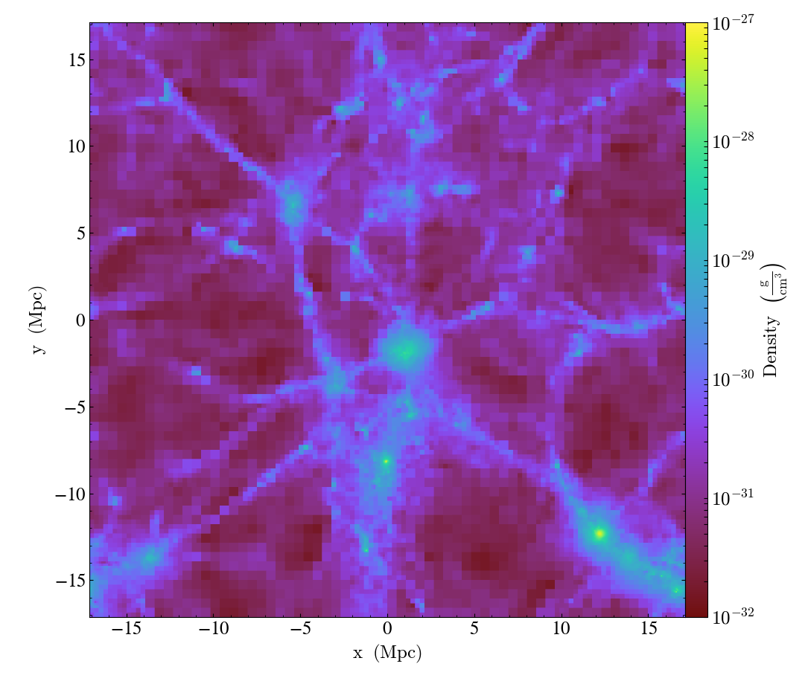
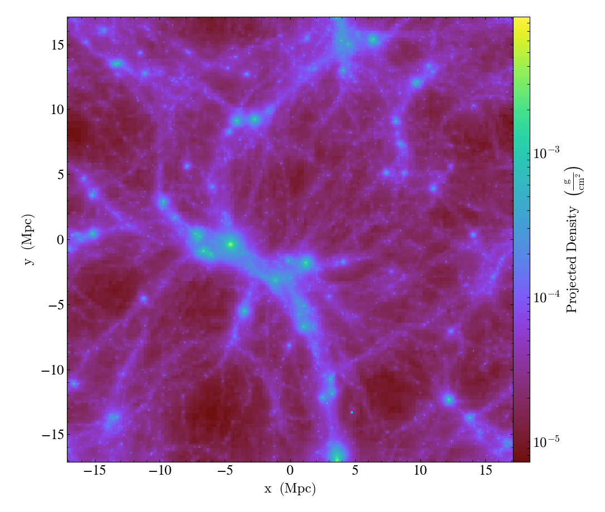
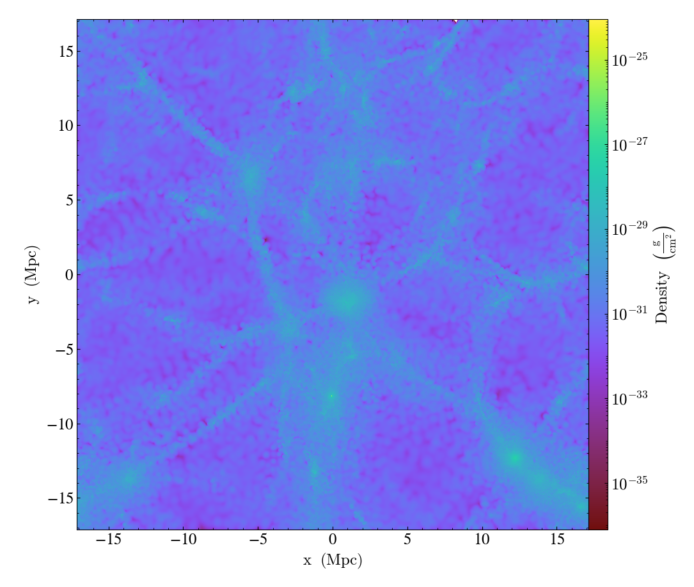
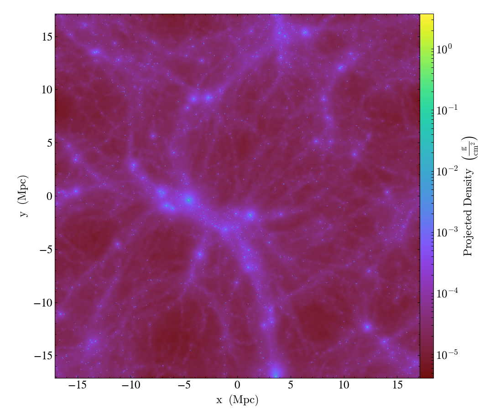

.. _ytep-0031:

YTEP-0031: Removing the global octree mesh for particle data
============================================================

Abstract
--------

| Created: February 9 2017
| Author: Nathan Goldbaum, Meagan Lang, Matthew Turk

The global particle octree index used by yt presents a barrier for improving the
performance and scalability of visualizing and analyzing particle datasets. This
YTEP proposes removing the global octree index, replacing it with a combination
of a new IO system and changes to the high-level yt API to focus on returning
particle-centric data. The particle I/O refactor makes use of an indexing scheme
based on compressed Morton bitmaps which dramatically improves memory usage and
scaling for large particle datasets by eliminating the need for a global octree
index.

Rather than constructing a global index to maintain backward compatibility at
the cost of scaling and performance, we instead propose a reworking of the yt
user interface for particle and SPH data to be more "particle-centric". This
means that data object selections for fields that are now defined on the global
octree mesh will instead return field data at particle locations. For SPH data,
visualizations of slices and projections are done in the image plane, making use
of the "scatter" approach by smoothing SPH data directly onto images, employing
either a volumetric or projected SPH smoothing kernel. Fully local derived
fields are calculated using yt's existing field definitions but passing in data
defined at particle locations. Fields that need spatial derivatives are
implemented using the SPH formalism and are also evaluated at the particle
locations.

Altogether these changes allow for improved performance and scaling, and allow
users to access, analyze, and visualize particle field data for SPH simulations
in a more straightforward fashion. While we do not propose substantial API
changes for mesh or octree codes, these changes to yt's field system for
particle data imply substantial changes to the *meaning* of yt's data selection
system for particle data. We discuss the implications of these backward
incompatible changes and how we intend to document and manage them in a way that
is minimally disruptive to users.

Status
------

In Progress. The implementation is mostly finished, although there are a few
features that still need to be implemented.

Project Management Links
------------------------

The code can be found in pull request 2382:

https://bitbucket.org/yt_analysis/yt/pull-requests/2382

The C++ compressed bitmap implementation we intend to vendor into yt:

https://github.com/lemire/EWAHBoolArray

Detailed Description
--------------------

Background
**********

Currently most user-facing operations on SPH data are produced by interpolating
SPH data onto a volume-filling octree mesh. When support for SPH data was added
to yt in the run-up to the yt-3.0 release, this approach allowed yt to support
SPH data in a way that could reuse the existing infrastructure in yt for octree
data and preserve core assumptions in yt that ``gas`` fields must correspond to
a volume-filling AMR structure. While this did make initial support for SPH data
much easier, it also had some downsides. In particular, the memory and CPU
overhead of smoothing SPH data onto the octree can be prohibitive on particle
datasets produced by large simulations. Visualizations of slices and projections
produced by yt using the default ``n_ref`` and ``over_refine_factor`` are
somewhat blocky since by default we use a relatively coarse octree to preserve
memory. In addition, since we construct the global octree based on the positions
of all particles, visualizations that include only one particle type sometimes
include "holes" in regions under-sampled by that particle type.

These cosmetic and semantic issues are jarring to users of SPH codes, who tend
to think of data defined at the particle locations rather than sampled onto an
adaptive mesh. Making our high-level API focus more on particle-centric data
will help to ease the cognitive dissonance felt by users of SPH codes when they
work with yt.

Over the past two years, Meagan Lang and Matt Turk implemented a new approach
for handling I/O of particle data, based on storing compressed bitmaps
containing Morton indices instead of an in-memory octree. This new capability
means that the global octree index is now no longer necessary to enable I/O
chunking and spatial indexing of particle data in yt.

In this document we describe the approach we take for replacing the global
octree index with Morton bitmasks. First, we describe the implementation of the
Morton bitmask index, changes to the low-level selector API needed to support
the Morton bitmask work, and the testing strategy used for the Morton bitmap
indexing scheme. Next we discuss high-level changes to how yt handles particle
data, changes to the field system for SPH data, the implementation of the SPH
pixelizer system for visualizations, a discussion of deposit fields, and a
description of the strategy used to test the new approach for SPH data. We close
with a discussion of questions that still need to be tackled before this work
can be merged.

Low-Level Implementation
************************

Morton Bitmap Index
+++++++++++++++++++

The generated index serves to map how the domain is populated by particles in
datasets split across multiple files. This way, spatial queries can skip files
that do not contain particles in the selected part of the domain. The files are
mapped by storing two nested Morton indices for each particle in a
dataset. Rather than storing the indices in plaintext, we make use of an EWAH
compressed boolean array bitmap. Given a domain with known boundaries in each
dimension, a 3-dimension position can be described by a single integer `Morton
index <https://en.wikipedia.org/wiki/Z-order_curve>`_ by

1. Dividing the domain into ``2^index_order1`` cells in each dimension with
   widths ``ddx = domain_width_x/(2^index_order1)``.
#. Determining the 3 integers specifying the cell that contains the 3D
   position (e.g. ``x/ddx``).
#. Combine the 3 integers into a single integer by alternating bits from each
   dimension.

These indices can be stored as either integers or in boolean masks. In the case
of the mask, an array of zeroed bits is created with a length equal to the
maximum possible index for the chosen value of ``index_order1``. Then the bits
for the indices present are set to one. To save space, boolean masks in the form
of bitmaps can then be compressed further using the `Enhanced Word-Aligned
Hybrid (EWAH) bitmap compression algorithm
<https://doi.org/10.1145/1458432.1458434>`_. In practice, we make use of a
vendored version of `EWAHBoolArray <https://github.com/lemire/EWAHBoolArray>`_,
a C++ EWAH bitmask implementation available under the Apache v2 license.

One bitmap is created for each file. If an index is present in more than one
file’s bitmap, this represents a collision and decreases the likelihood that
the bitmap can be used to exclude files during spatial queries. This is unlikely
if the particles are well partitioned between the files according to a domain
decomposition scheme at the chosen order, but this is not generally true of
particle datasets produced by astrophysical simulations. In these cases, it
is better to create a more refined index.

Using a larger ``index_order1`` increases the refinement of the index, but also
increases both the memory required to store the indices and the time required
to query them for EWAH bitmaps. To combat this, we include a second refined
index within those cells that have indices in multiple files’ bitmaps for the
coarse index. For each particle with a coarse index that collides with another
file, a second refined Morton index is creating by following the same procedure
as for the coarse index, but exchanging the domain boundaries for the boundaries
of the coarse index cell. The refined index for each file is then stored in a
EWAH bitmap for each coarse cell with a collision.

The coarse and refined indices are generated in two separate I/O passes over the
entire dataset. To generate the coarse index, the coordinates of all particles,
as well as the softening lengths for SPH particles, are read in from each
file. For each particle we then compute the Morton index corresponding to the
particles position within the domain. This index, ``mi`` is then used to set the
``mi``\ th element in a boolean mask for the file to 1. If the particle is an
SPH particle, neighboring indices with cells that overlap a sphere with a radius
equal to the particle’s softening length and centered on the particle are also
set to 1.

Once a coarse boolean mask is obtained for each file, the masks are stored in a
set of EWAH compressed bitmaps (implemented in the ``ewah_bool_array`` Cython
extension classes). Using logical boolean operations, we then identify those
indices that are set to 1 in more than one file’s mask (the collisions).

During a second I/O pass over the entire dataset, refined indices are created
for those particles with colliding coarse indices. Both the coarse and refined
indices are stored in an array for each file. One a file has been completely
read in, those indices are sorted and used to create a map from coarse indices
to EWAH compressed bitmaps. This is done because entries in EWAH compressed
bitmaps must be set in order.

The Morton bitmap index is created for each particle dataset upon its first
ingestion into yt and saved to a sidecar file. At all future ingestions of the
dataset into yt, the index will be loaded from the sidecar file. Indexes are
managed through the Cython extension class ``ParticleBitmap`` (defined in
``yt/geometry/particle_oct_container.pyx``), which is exposed to the user
visible yt API via the ``regions`` attribute of the ``ParticleIndex`` class
(e.g. ``ds.index.regions``). The ``ParticleBitmap`` class generates EWAH bitmaps
via the ``BoolArrayCollection`` Cython extension object (defined in
``yt/utilities/lib/ewah_bool_wrap.pyx``), which wraps the underlying
``EWAHBoolArray`` C++ library.

In the current implementation users can control the creation of the bitmask
index via the ``index_order`` and ``index_filename`` keyword arguments accepted
by ``SPHDataset`` instances. These keyword arguments replace the deprecated
``n_ref``, ``over_refine_factor`` and ``index_ptype`` keyword arguments. The
``index_order`` is a two-element tuple corresponding to the maximum Morton order
for the coarse and refined index. Using a tuple for the ``index_order`` instead
of two keyword arguments is not only more terse, but it will allow us to produce
bitmask indexes in the future with multiple refined indices while maintaining
the same public API. Currently the default ``index_order`` is ``(7, 5)``. If a
user specifies ``index_order`` as an integer, the integer is taken as the order
of the coarse index and the order of the refined index is set to ``1``,
producing a trivial refined index. For example::

  import yt
  ds = yt.load('snapshot_033/snap_033.0.hdf5',
               index_order=(5, 3), index_filename='my_index')
  ds.index

Running this script will produce the following output::

  yt : [INFO     ] 2017-02-14 11:50:20,815 Allocating for 4.194e+06 particles
  Initializing coarse index at order 5: 100%|██████| 12/12 [00:00<00:00, 14.60it/s]
  Initializing refined index at order 3: 100%|█████| 12/12 [00:01<00:00,  8.80it/s]

And produce a file named ``my_index`` in the same folder as
``snapshot_033/snap_033.0.hdf5``. The second and all later times the script is
run we only need to load the index from disk, so it produces the following
output::

  yt : [INFO     ] 2017-02-14 11:56:07,977 Allocating for 4.194e+06 particles
  Loading particle index: 100%|███████████████████| 12/12 [00:00<00:00, 636.33it/s]

Note that there 12 iterations for each loop. Each of these iterations correspond
to a single IO chunk. If a file has fewer than 262144 particles, the entire file
is used as an IO chunk. If a file has more than 262144 particles, the file is
logically split into several subfiles, each containing up to 262144
particles. Currently the chunk size of 262144 particles is hard-coded for all
SPH frontends.

Changes to the Selector API
+++++++++++++++++++++++++++

The Morton bitmaps needed for individual data objects are constructed using the
existing low-level Cython selection API. To determine whether a given Morton
index is "contained" in the geometric primitive defined by the selector we make
use of the ``select_bbox`` selection API call, since each index corresponds to a
single cell in an octree. If the selector fully encloses the bounding box for
the cell defined by a given Morton index, the existing ``select_bbox`` function
is sufficient. However, given that the goal of the Morton bitmap index is to
reduce the number of files we need to read from for a given selection operation,
more care must be taken near the "edges" of a selector. For this reason, we have
added a new function to the selector API, ``select_bbox_edge``. This function is
identical to ``select_bbox`` in the case when a bounding box is fully contained
inside of the geometric primitive associated with a selector, simply returning 1
in these cases. However, if the bounding box is only partially contained in the
geometric primitive, ``select_bbox_edge`` returns 2, indicating partial
overlap. This is used in the bitmap index code to indicate that the coarse
Morton index does not have sufficient resolution in this region, triggering the
generation of refined Morton indices in this region. These smaller bounding
boxes will have a higher probability of being either fully contained or fully
excluded from a data object, decreasing the probability of a file collision. The
``select_bbox_edge`` function has been implemented for all selectors and if this
YTEP is accepted will be a required part of the API for new selectors in the
future.

In addition to the above change, a more minor change was necessary to the
portion of the selector API used to count and select particles contained in a
given selector. Currently, all particles are assumed to be pointlike, which will
lead to incorrect selections for particles that actually have finite volumes
like SPH particles. To account for this, the signature of the ``count_points``
and ``select_points`` functions were changed so that instead of accepting only
single scalar radius for all particles, they can accept an array of possibly
variable radii as well. If non-zero radii are passed in, particle selection
operates via the ``select_sphere`` method instead of the ``select_point`` method
that is currently used. Since some selectors did not yet have implementations
of ``select_sphere``, we have added new implementations where necessary.

Testing
+++++++

Removing the Global Octree Mesh
*******************************

Currently, all I/O operations are mediated via the global octree
index. Particles are read in from the output file as needed based on their
position in the octree.  With the arrival of the compressed bitmap index scheme
described above, we no longer need to use the global octree to manage I/O
chunking. Making the global octree redundant in this way raises the question
about whether the octree is really needed at all.

Currently yt makes a distinction between particle fields and mesh fields. All
SPH-smoothed fields (e.g. ``('gas', 'density')``) are smoothed onto the global
octree mesh. To make a concrete example, let's try loading an SPH zoom-in
simulation of a galaxy and ask for the ``('gas', 'density')`` field::

  import yt
  ds = yt.load('GadgetDiskGalaxy/snapshot_200.hdf5')

  ad = ds.all_data()
  density = ad['gas', 'density']

  print(density.shape)
  print(ds.particle_type_counts)

Running this script on the latest development version of yt at time of writing
(``abf5a8eff1b2``) produces the following output::

  (5661944,)
  {'PartType0': 4334546,
   'PartType1': 4786616,
   'PartType2': 2333848,
   'PartType3': 0,
   'PartType4': 450921,
   'PartType5': 1149}

On my laptop, this script also takes about 116 seconds to run, with 105 s spent
performing the SPH smoothing operation onto the global octree. Note also how the
number of leaf octs in the octree (5661944) does not match the number of SPH
particles (``PartType0``). This discrepancy is a common source of initial
confusion for users of SPH codes when they first try to use yt to analyze their
data.

We can ask ourselves whether it makes sense to always smooth data onto the
global octree. It makes intuitive sense for users of AMR codes for yt to return
data defined on a volume-filling mesh, since the volume filling mesh is the
"real" data. However, for SPH data, the global octree mesh is not representative
of the "native" data. By making the return value of most yt operations for SPH
fields be defined on the octree mesh, yt is not being "true" to the data and
also makes it harder than it needs to be to access the particle data as such.

In this YTEP, **we propose changing the data object API for SPH data by ensuring
that all SPH smoothed fields return data defined at the locations of SPH
particles**. This means that rather than relying on smoothing data onto the
global octree, we will instead always return data defined at the particle
locations. This means that running the script included above would produce the
following output::

  (4334546,)
  {'PartType0': 4334546,
   'PartType1': 4786616,
   'PartType2': 2333848,
   'PartType3': 0,
   'PartType4': 450921,
   'PartType5': 1149}

And that the ``('gas', 'density')`` field would merely be an alias to the
``('PartType0', 'Density')`` field available on-disk. Since we no longer need to
smooth data onto the in-memory global octree, this substantially reduces the
memory needed to work with SPH data while simultaneously substantially improving
performance. Just as an example, in the version of the yt that implements this
YTEP, the script at the top of this section requires only 3.3 seconds to run.

The details of how this backward incompatible change to the yt user experience
for SPH data will be implemented is detailed below. This includes all design
decisions that have been made in the prototype version of yt that implements
this YTEP. In addition, there are still several design decisions about how to
implement this YTEP that have not yet been decided on. For more details about
these issues, see the "Open Questions" section at the bottom of this document.

Identifying the SPH Particle
++++++++++++++++++++++++++++

All of the proposals in this YTEP require that there be special handling for
fields that correspond to the SPH particle type. Currently yt does not have a
way of identifying whether a given particle type in a particle dataset is an SPH
particle. To ameliorate this, we propose adding a new private attribute of
``SPHDataset`` instances, ``_sph_ptype``. This attribute should resolve to the
string name of the SPH particle type for the given output type. For example, for
Gadget HDF5 data, the ``_sph_ptype`` is ``'PartType0'``. Having this attribute
available makes it much easier to write code that does special handling for SPH
data.

SPH Fields
++++++++++

Here we discuss changes to the yt field system for SPH particle data that will
enable removing the global octree mesh.

Local Fields
^^^^^^^^^^^^

Currently yt assumes that fields with a ``'gas'`` field type are defined on a
volume filling mesh. This YTEP proposes relaxing that assumption for SPH data so
that ``'gas'`` fields correspond to *particle* fields. Since we would like to
reuse the existing field definitions in yt as much as possible, we need to
explore how to adjust the field system to allow reuse of existing fields when
the field data might represent local particle data, SPH smoothed quantities, or
mesh fields, depending on the type of data being loaded.

As a reminder, ``sampling_type`` is a newly introduced keyword
argument that can be passed to the initializer for yt ``DerivedField`` objects
that will be released publicly as part of yt 3.4. It replaces the
``particle_type`` keyword argument, allowing more flexibility to define new
types of fields that are sampled in novel ways without needing to expose
additional keyword arguments like ``particle_type``. Currently, the default
value of ``sampling_type`` is ``'cell'``, preserving the old default behavior
(e.g. ``particle_type=False``).

We propose changing the default value of the ``sampling_type`` used for yt
derived fields from ``'cell'`` to a new value: ``'local'``. Derived fields with
``sampling_type='local'`` are fully local functions of other derived fields
(which themselves do not have to be fully local). It turns out that nearly all
of the fields that are currently defined inside yt with ``sampling_type='cell'``
are actually fully local and the field functions they encode can be readily
reused with particle data. In the version of yt that implements this YTEP, all
fully local derived fields defined inside yt have had their field definitions
altered such that ``sampling_type='local'``.

With this accomplished, making all fully local derived fields work simply
requires setting up SPH particle fields with aliases to yt "universal" field
names. To make that concrete, this means that a Gadget HDF5 output needs an
alias from ``('PartType0', 'Density')`` to ``('gas', 'density')``. With this
alias defined, all fully local derived fields that depend only on ``('gas',
'density')`` will automatically work. In addition, any *particle* derived fields
defined for the ``PartType0`` with field names that begin with ``'particle_'``
will be aliased to ``'gas'`` fields without the ``'particle_`` prefix. For
example, the ``('PartType0', 'particle_angular_momentum_x')`` field is aliased
to ``('gas', 'angular_momentum_x')``. This means that any ``'gas'`` derived
fields that depend on ``('gas', 'angular_momentum_x')`` being defined will
function as expected. In other words, we use the existing system of particle
fields to bootstrap the needed "input" fields for the bulk of the ``'gas'``
derived fields. The aliasing described here is implemented in the
``setup_smoothed_fields`` member function of the ``FieldInfoContainer`` class.

One side effect of this approach is that there are some "odd" ``'gas'`` derived
fields (particularly if one is coming from an AMR code). For example, ``('gas',
'position')`` is defined as an alias to ``('PartType0',
'particle_position')``. It may not be a good idea in the end to alias **all**
particle fields for the SPH particle type to ``'gas'`` fields, and it may be
necessary to add a blacklist of fields that should *not* be aliased, or that
should be aliased with explicit particle field names (e.g. maybe it would be
most helpful to define ``('gas', 'particle_position')``).

Non-local Fields
^^^^^^^^^^^^^^^^

Unfortunately, not all fields are fully local. We would optimally like to
support fields that require some sort of difference operation, in particular
physically meaningful fields like the gas vorticity or divergence. Currently
these fields are not supported for particle data (since ghost zones have not yet
been implemented for octrees), so if this effort makes it easier to add support
for these fields, that will be a substantial improvement.

It turns out that within the SPH formalism there is a straightforward way to
compute fields that depend on spatial derivatives. These formulae are used
internally in SPH codes to estimate various terms in the equations of fluid
dynamics. Thankfully, we can make use of these formulae for visualization and
analysis purposes. There is a very nice paper by Dan Price [PricePaper]_ that
works through this formalism, from which we can derive several formulae for
partial derivatives and vector derivatives. For some quantity :math:`A` that is
a function of position, the partial derivative of :math:`A` with respect to
:math:`x` at the position of particle :math:`a` can be evaluated via:

.. math::

    \frac{\partial{A_a}}{\partial{x}} = \sum_b \frac{m_b}{\rho_b} \frac{\phi_b}
    {\phi_a} \left(A_b - A_a\right) \frac{\partial_a{W_{ab}}}{\partial{x}}

Here :math:`m_b` and :math:`\rho_b` are the mass of and gas density associated
with the :math:`b`'th particle, :math:`\phi` is an arbitrary function of
position (common choices are :math:`1` and :math:`\rho`), and :math:`W_a` is the
SPH smoothing kernel at the position of particle :math:`a`. The derivative
inside the sum in the above expression is evaluated at the position of particle
:math:`a`.

Similarly for the gradient, divergence, and curl:

.. math::

    \nabla_a A = \sum_b \frac{m_b}{\rho_b} \frac{\phi_b}{\phi_a}
    \left(A_b -A_a\right) \nabla_a W_{ab}

    \left<\nabla \cdot \mathbf{A}\right>_a = \sum_b \frac{m_b}{\rho_b}
    \frac{\phi_b}{\phi_a} \left(\mathbf{A}_b - \mathbf{A}_a\right) \cdot
    \nabla_a W_{ab}

    \left<\nabla \times \mathbf{A}\right>_a = - \sum_b \frac{m_b}{\rho_b}
    \frac{\phi_b}{\phi_a} \left(\mathbf{A}_b - \mathbf{A}_a\right) \times
    \nabla_a W_{ab}

These symmetrized formulae (i.e. they all include a term that looks like
:math:`A_b - A_a`) have the advantage that the derivative of a constant field is
zero by construction.

To actually use these formula, we will need to calculate on a
particle-by-particle basis the list of nearest neighbors for each particle and
then evaluate these formulae at the locations of each particle. This has not yet
been implemented in the version of yt that implements this YTEP, but we expect
it to be straightforward using the existing functionality in yt to generate
nearest neighbor lists.

Non-local fields that do not depend on an explicit derivative operation will
(e.g. ``('gas', 'averaged_density')``) will not be implemented for SPH data.

.. [PricePaper] http://adsabs.harvard.edu/abs/2012JCoPh.231..759P

Data Selection for SPH Fields
+++++++++++++++++++++++++++++

Currently data selection for particle fields models all particles, including SPH
particles, as infinitesimal points. This means that 2D data objects do not
select particles without exact floating point intersection between the data
object and the particle.

This YTEP proposes modifying the selection semantics for SPH particles. Instead
of modeling SPH particles as infinitesimal points, we will select SPH particles
if the smoothing volume intersects with the data container. This means that
particles with positions outside of 3D data containers will be selected, since
if the smoothing volume overlaps these particles still contribute to estimates
of fluid quantities inside of the data object. See :ref:`data-object-tests` for
more discussion of the testing strategy used to validate the yt data object and
data selection system for SPH particles.

We have implemented and added unit tests for all of the following data objects:

- Point
- Slice
- Off-axis Slice
- Region
- Disk
- Ray

In addition, we have implemented the following data object features that depend
on hooks in the C selector API:

- Chained selection (e.g. ``reg = ds.region(..., data_source=sphere)``)
- Boolean negation
- Boolean addition
- Boolean AND
- Boolean XOR
- ``ds.intersection``
- ``ds.union``

Visualization of Slices and Projection
++++++++++++++++++++++++++++++++++++++

Currently slices and projections of SPH data are generated by slicing data that
has been SPH smoothed onto the global octree. If there is no more global octree,
an alternative strategy for generating pixelized representations of SPH data
needs to be implemented. This YTEP proposes replacing the pixelizer operations
for slices, off-axis slices, and axis-aligned projections to make use of an
SPH-centric pixelization operation. For inspiration, we look to `SPLASH
<http://users.monash.edu.au/~dprice/splash/>`_, an open-source SPH visualization
tool written in Fortran. The algorithms used in SPLASH are detailed in the
SPLASH method paper [SPLASHPaper]_.

The key to the pixelization algorithm used in SPLASH is to compute the SPH
smoothing operation via the "scatter" approach. Rather than looping over pixels
in the image, determining which particles contribute to the SPH smoothing
operation at the location of that pixel, and then compute a field value using
the SPH smoothing formula, we instead loop over particles, finding the set of
pixels whose smoothing volumes overlap with the pixel location and deposit a
contribution for that particle to all of the pixels the smoothing volume
overlaps. As we loop over all of the particles that contribute to the image, we
fill in the image by summing the contributions of each particle. This approach
is attractive because it does not require any sort of nearest-neighbor operation
and is also trivially parallelizable using e.g. OpenMP threads.

For slices we estimate the contributions of a particle to a single pixel using
the standard SPH smoothing formula. For Projections we make use of a projected
version of the smoothing formula, taking advantage of the spherical symmetry of
the problem. The smoothing operation is implemented in two Cython functions:
``pixelize_sph_kernel_slice`` and ``pixelize_sph_kernel_projection`` which are
defined in ``yt.utilities.lib.pixelization_routines``.

To make the above discussion a bit more concrete, consider the following
script::

  import yt

  ds = yt.load('snapshot_033/snap_033.0.hdf5')

  yt.SlicePlot(ds, 2, ('gas', 'density')).save()

  yt.ProjectionPlot(ds, 2, ('gas', 'density')).save()

Running the latest development version of yt at time of writing
(``25651334863b``) requires 43 seconds to run and produces the following images:

Slice:

Projection:

Running the same script on the version of yt that implements this YTEP produces
requires 20 seconds and produces the following images:

Slice:

Projection:

Note also that the performance improvement here becomes more stark for larger
datasets as well as for zoom-in simulations which have deeper octrees.

The images produces using the octree are quite "blocky", since the resolution of
the image in any given location is limited by the octree. This could be
ameliorated somewhat using ``over_refine_factor`` but that requires steeper
memory requirements to smooth onto the octree. In general these images are
"truer" to the actual structure of the data. Rather than generating an image
from a sampled representation of the real data, it is our opinion that it makes
more sense to instead sample directly from the particle data.

.. [SPLASHPaper] http://adsabs.harvard.edu/doi/10.1071/AS07022

Deposition operations
+++++++++++++++++++++

.. _data-object-tests:

Testing
+++++++

Open Questions
--------------

The Projection Data Object
**************************

Cut Regions
***********

Global Octree or Octree Subset Data Object
******************************************

Volume Rendering
****************

Do We Need Particle Fields?
***************************

Community engagement
********************

yt 4.0?
*******
