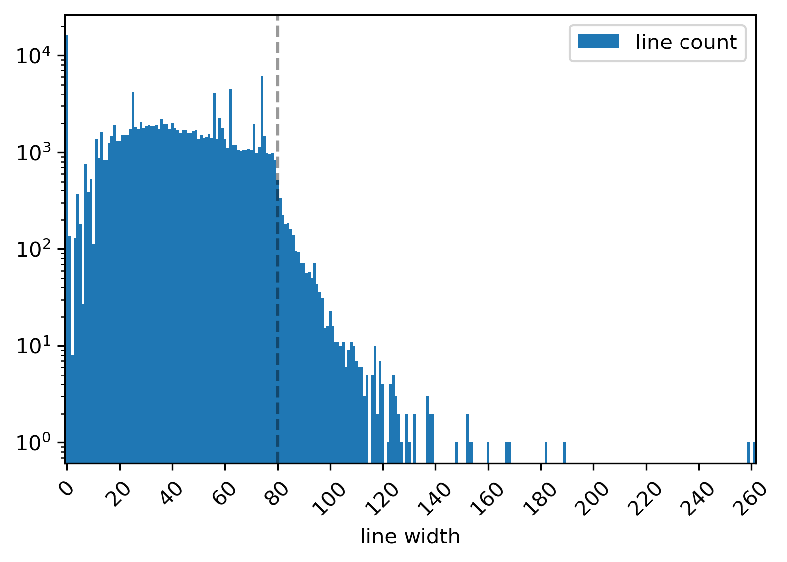

YTEP-0035: Code styling
=======================

Abstract
--------

Created: May 18, 2020
Author: Clément Robert

This YTEP proposes the enforcement of code styling guidelines with auto-formatting tools.

Status
------

Proposed

Project Management Links
------------------------

The follow PR corpus demonstrates the feasibility of the proposal

  * sorting imports with `isort <https://github.com/timothycrosley/isort>`_ (`#2592 <https://github.com/yt-project/yt/pull/2592>`_)
  * code formatting with `black <https://github.com/psf/black>`_ (`#2596 <https://github.com/yt-project/yt/pull/2596>`_)
  * redirect internal imports from the wrapper module ``yt.units`` to ``unyt`` (`#2597 <https://github.com/yt-project/yt/pull/2597>`_)
  * add a ``pyproject.toml`` file (`#2598 <https://github.com/yt-project/yt/pull/2598>`_)
  * add a precommit hook configuration file (`#2600 <https://github.com/yt-project/yt/pull/2600>`_)

Detailed Description
--------------------

Code styling guidelines are already presented in the `project's documentation
<https://yt-project.org/docs/dev/developing/developing.html#coding-style-guide>`_,
though enforcing them is not explicitly made part of the reviewing process.
We already use ``flake8``, and integrate it to our CI to catch a subset of infractions
to PEP8. 

``black`` automatically enforces a superset of those rules, and offers very little
configuration option by design. Only the target line length can be changed.
This makes it the only point requiring discussion if this YTEP is approved.

**maximal line length**

The guidelines states that

    Line widths should not be more than 80 characters

Despite this being respected in most of the code base, there remain a large amount of
outliers, that would be time-consuming to go through by hand. Taking the example of the
yt-4.0 branch at the time of writing, there are 2676 lines exceeding 80 characters (~2%
of the whole code base), or, visually

Note that in some cases, ``black`` will leave long lines as is. For instance, it won't
split a 200-chars long string. 

There is a range of possible values we might give preference to. Python's standard
library caps linelenght at 79, pandas does so at 80. By default, ``black`` will target
88, as its authors claim it reduces the total number of lines by some 10% (as compared
to enforcing 80).

In first drafting the PR linked above, I chose a line-lenght of 100, so as to minimize
the amount of manual tweaking left to me after a ``black`` pass.
I estimated that imposing a strict limit to 80 chars would leave 4320 lines to be
manually updated, while caping at 88 leaves a mere ... 1341 (still a 75% less work :-)).

**sorting imports**

PEP8 `recommends sorting imports statments <https://www.python.org/dev/peps/pep-0008/#imports>`_,
Needless to say, the task is daunting and definitely not worthy of anyone's time if we
had to go back and apply those rules manually to the code base.
Luckilly, ``isort`` is able to check for and auto-apply those rules, so it can easily be
added to the CI-linting process.

Moreover, ``isort`` is configurable so that it allows for the definition of custom
"sections" within import statements. This can be use to isolate imports from ``unyt``,
which falls somewhere in between the default sections "third party" (external
dependency) and "first party" (the project). This is done in 
`#2592 <https://github.com/yt-project/yt/pull/2592>`_.

To better highlight the way yt 4.0 depends on ``unyt``, I also propose that, within the
code base, we import directly from ``unyt`` as often as possible, so as to limit
confusion between ``unyt`` and its wrapper interface ``yt.units``. This is done in 
`#2597 <https://github.com/yt-project/yt/pull/2597>`_.

**Side effects**

Although some default options in ``isort`` conflict with ``black``'s opinated standard,
it can be configured so that the tools play nicely with each other.
This is demonstrated in `#2596 <https://github.com/yt-project/yt/pull/2596>`_ where both
check pass on Travis.

On another note, black only recognizes ``pyproject.toml`` as a configuration file (and
is explicitly not planning to support other files such as ``setup.cfg``).
An undesirable effect of using  ``pyproject.toml`` solely as a configuration file for
``black`` is that ``pip`` will detect it and change its behaviour when its present. The
correct way to introduce this file is by specifying yt's build requirements within it. 
A proof of concept for this is `#2598 <https://github.com/yt-project/yt/pull/2598>`_,
where CI builds are run correctly across all tested python versions (3.6, 3.7, 3.8).

A serious counter-argument to applying black is that it implies messing up with ``git
blame`` by making a single contributor the defacto last-author of a large number of
lines they have not even necessarily read. Most recent versions of ``git`` can be
configured to ignore specific commits in ``git blame``. However, ``black``'s own README
currently points out that github's UI for ``git-blame`` does not support this feature
(yet ?).
 

**outreach**

Enforcing these change throughout future contributions can be done by

* updating the Developper Guide (done in part in `#2592 <https://github.com/yt-project/yt/pull/2592>`_)
* offering a precommit hook configuration file to help contributors automate the linting stage locally (``precommit_hook.yaml``)
such a configuration file is propoed in  `#2600 <https://github.com/yt-project/yt/pull/2600>`_
Backwards Compatibility
-----------------------

Yes.

Alternatives
------------

* Enforcing styling guidelines through pier review for each PR. Obviously this is a
  lot more work. Additionally, this methodology is prone to error and may cause delay in
  the PR approval process in case the authors disagree with the reviewers on the
  application of styling rules.
* Leaving code style decisions up to authors, and embracing the style diversity. 

