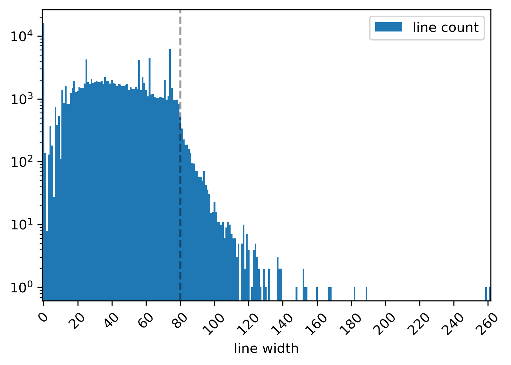

YTEP-0037: Code styling
=======================

Abstract
--------

Created: May 18, 2020
Author: Clément Robert

This YTEP proposes the enforcement of code styling guidelines with auto-formatting tools.

Status
------

Proposed

Project Management Links
------------------------

The following PR corpus demonstrates the feasibility of the proposal

  * sorting imports with `isort <https://github.com/timothycrosley/isort>`_ (`#2592 <https://github.com/yt-project/yt/pull/2592>`_)
  * code formatting with `black <https://github.com/psf/black>`_ (`#2596 <https://github.com/yt-project/yt/pull/2596>`_)
  * redirect internal imports from the wrapper module ``yt.units`` to ``unyt`` (`#2597 <https://github.com/yt-project/yt/pull/2597>`_)
  * add a ``pyproject.toml`` file (`#2598 <https://github.com/yt-project/yt/pull/2598>`_)
  * add a precommit hook configuration file (`#2600 <https://github.com/yt-project/yt/pull/2600>`_)

Detailed Description
--------------------

Code styling guidelines are already presented in the `project's documentation
<https://yt-project.org/docs/dev/developing/developing.html#coding-style-guide>`_,
though enforcing them is not explicitly made part of the reviewing process.

We already use ``flake8`` and integrate it to our CI to catch a subset of
infractions to `PEP 8 <https://www.python.org/dev/peps/pep-0008/>`_. From
``flake8``'s `pipy page <https://pypi.org/project/flake8/>`_

  Flake8 is a wrapper around these tools:
    - PyFlakes
    - pycodestyle
    - Ned Batchelder’s McCabe script

From ``black``'s `documentation <https://black.readthedocs.io/en/stable/the_black_code_style.html>`_

  The rules for horizontal whitespace can be summarized as: do whatever makes
  pycodestyle happy.
  (...)
  The coding style used by Black can be viewed as a strict subset of PEP 8.

so it is expected that ``black`` plays nicely with ``flake8`` by construction.
``black`` applies an opinated style, and offers very little configuration options
by design. Only the target line length can be changed. This makes it a critical 
point, requiring discussion if this YTEP is approved.

**maximal line length**

The guidelines states that

    Line widths should not be more than 80 characters

Despite this being respected in most of the code base, there remains a large amount of
outliers, that would be time-consuming to go through by hand. Taking the example of the
yt-4.0 branch at the time of writing, there are 2158 lines exceeding 80 characters
(~1.5% of the whole code base), or, visually

Note that when long strings are present, ``black`` will not attempt to split them to
shorten the individual lines.
This is most important in the case of dosctrings, and I explore the tools available to
validate them hereafter (see `additional rules`_).

There is a range of possible values we might give preference to. Python's standard
library caps linelenght at 79, pandas does so at 80. By default, ``black`` will target
88, as its authors claim it reduces the total number of lines by some 10% (as compared
to enforcing 80).

In first drafting the PR linked above, I chose a line-lenght of 100, so as to minimize
the amount of manual tweaking left to me after a ``black`` pass.
I estimated that imposing a strict limit to 80 chars would leave 545 lines to be
manually updated, while caping at 88 leaves a mere 135 (75% less work).

**sorting imports**

PEP8 `recommends sorting imports statments <https://www.python.org/dev/peps/pep-0008/#imports>`_,
Needless to say, the task is daunting and definitely not worthy of anyone's time if we
had to go back and apply those rules manually to the code base.
Luckilly, ``isort`` is able to check for and auto-apply those rules, so it can easily be
added to the CI-linting process.

Moreover, ``isort`` is configurable so that it allows for the definition of custom
"sections" within import statements. This can be use to isolate imports from ``unyt``,
which falls somewhere in between the default sections "third party" (external
dependency) and "first party" (the project). This is done in 
`#2592 <https://github.com/yt-project/yt/pull/2592>`_.

To better highlight the way yt 4.0 depends on ``unyt``, I also propose that, within the
code base, we import directly from ``unyt`` as often as possible, so as to limit
confusion between ``unyt`` and its wrapper interface ``yt.units``. This is done in 
`#2597 <https://github.com/yt-project/yt/pull/2597>`_.

.. _additional rules:
**additional rules (flake8 pluggings)**

`flake8-bugbear <https://github.com/PyCQA/flake8-bugbear>`_ is a ``flake8`` plugging
that goes beyond code style and detects some additional anti-patterns, most of which are
correspond very likely to design flaws in otherwise syntaxically valid statement. For
instance, it will catch mutable default values such as in

.. code:: python

    def spam(a={}, b=[]):
        #...

which, in most contexts, should be rewritten as 

.. code:: python

    def spam(a=None, b=None):
        if a is None:
            a = {}
        if b is None:
            b = []
        
This is a well known "gotcha", as documented for instance
`here <https://docs.python-guide.org/writing/gotchas/#mutable-default-arguments>`_.
In short, this plugin detects bugs that went under the radar up to now, so it's
probably worth adding it to our linting CI.

Another plugging can be added to enforce docstring formatting
(`flake8-docstrings <https://github.com/PyCQA/flake8-docstrings>`_), and has a
straight-forward option configuration to validate docstrings are numpy-styled. However,
there is currently a very large debt in errors caught by this tool, and no way to
automatically solve them. However, it could still be added to our linting CI, if check
for *new* errors only, such as

.. code:: bash

    git diff upstream/master -u -- "*.py" | flake8 --diff

(snippet borrowed from pandas' contributing guide)

**side effects**

Although some default options in ``isort`` conflict with ``black``'s opinated standard,
it can be configured so that the tools play nicely with each other.
This is demonstrated in `#2596 <https://github.com/yt-project/yt/pull/2596>`_ where both
check pass on Travis.

On another note, black only recognizes ``pyproject.toml`` as a configuration file (and
is explicitly not planning to support other files such as ``setup.cfg``).
An undesirable effect of using  ``pyproject.toml`` solely as a configuration file for
``black`` is that ``pip`` will detect it and change its behaviour when its present. The
correct way to introduce this file is by specifying yt's build requirements within it. 
A proof of concept for this is `#2598 <https://github.com/yt-project/yt/pull/2598>`_,
where CI builds are run correctly across all tested python versions (3.6, 3.7, 3.8).

A serious counter-argument to applying black is that it implies messing up with ``git
blame`` by making a single contributor the defacto last-author of a large number of
lines they have not even necessarily read. Most recent versions of ``git`` can be
configured to ignore specific commits in ``git blame``. However, ``black``'s own README
currently points out that github's UI for ``git-blame`` does not support this feature
(yet ?).

It should be noted that ``black`` does not have a parser for Cython files, but
interstingly ``flake8`` and ``isort`` do. Thus it is possible to add style checks for
Cython extensions to the CI pipeline.

Additionally, ``black`` will not force line-lenght limits in docstrings.
``flake8`` will still be able to catch violations there, but solving them
require manual tweaking. However, the amount of existing docstrings going over
88 characters is fairly small (a few dozens), so this is by no means a blocking
condition.

**outreach and transition**

Enforcing these change throughout future contributions can be done by

* updating the Developper Guide (done in part in `#2592 <https://github.com/yt-project/yt/pull/2592>`_)
* offering a precommit hook configuration file to help contributors automate the linting stage locally (``precommit_hook.yaml``)
such a configuration file is propoed in  `#2600 <https://github.com/yt-project/yt/pull/2600>`_

It is expected that transitioning to the "blackened" version of the code will add a bit
of overhead in merging pre-existing PRs. Specifically, a simple ``git merge <pr-branch>
<target-blackened-branch>`` will almost certainly raise git conflicts. A potential
solution to this is to sanitize the pr-branch (on author side) with:

.. code:: shell

    pip install black
    black --line-width <N> yt/
    git merge --strategy ours <target-blackened-branch>
    git push

I tested this strategy locally by simulating blackening at an arbitrary point in the
past and merging the current state of the code base back in, producing a net zero diff
with a direct blackening of the current state. In practice I advise caution, and
sanitized code should be reviewed before merging.

The shorter the transition, the easier, so I think that most of the PRs could be
merged in a very narrow time window (a day or two), provided the appropriate
conditions. However, because we want to ensure that each step passes the tests,
which typically takes a least an hour or two per step, I propose that prep steps
be done separately, and the big one (blackening) happen on a meeting.

A possible roadmap
------------------

**pre meeting**

* settle on a maximal line length and the status of unyt ("second" or third party)
* merge isort pass on the code base + CI check + doc
* optional (needs approval) merge `#2597 <https://github.com/yt-project/yt/pull/2597>`_
* merge (needs tweaking) `#2598 <https://github.com/yt-project/yt/pull/2598>`_
* rebase blackening PR on the target branch (yt-4.0 ?) and prepare it with agreed line length
* provided all CI check pass and the PR is reviewed & approved, this goes to a PR triage meeting

**on the meeting**

* merge blackening + manual fixups + CI checks + doc
* signal to open PR authors that they should apply black (see transitioning strategy)

**can be done later**

* merge `#2600 <https://github.com/yt-project/yt/pull/2600>`_
* merge `#2595 <https://github.com/yt-project/yt/pull/2595>`_
* reduce flake8 ignore list, add bugbear plugin and correct detected anti-patterns

Backwards Compatibility
-----------------------

Yes.

Alternatives
------------

* Enforcing styling guidelines through peer review for each PR. Obviously this is a
  lot more work. Additionally, this methodology is prone to error and may cause delay in
  the PR approval process in case the authors disagree with the reviewers on the
  application of styling rules.
* Leaving code style decisions up to authors, and embracing the style diversity. 
