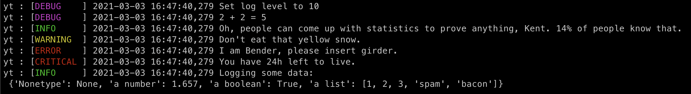
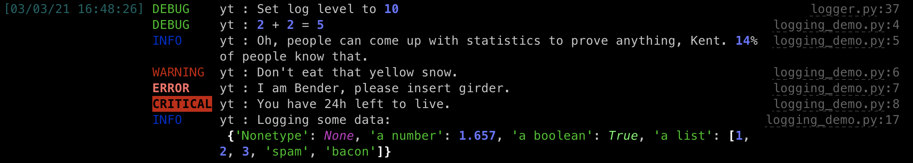
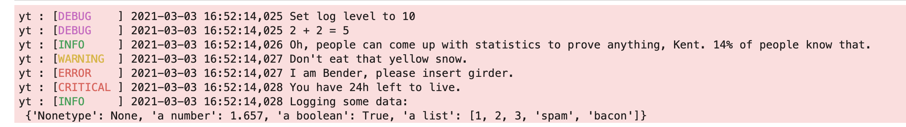
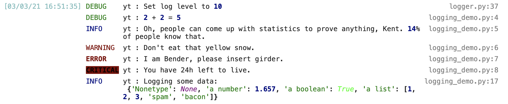

YTEP-0039: Rich Terminal User Interface
=======================================

Abstract
--------

Created: March 3, 2021
Author: Clément Robert

Use ``rich`` to prettify our TUI (Terminal User Interface). Most notably logs, and
progress bars (as a replacement for ``tqdm``).

Status
------

Proposed

Project Management Links
------------------------

- rich logging `#3106 <https://github.com/yt-project/yt/pull/3106>`_
- rich progress bars `#3114 <https://github.com/yt-project/yt/pull/3114>`_
- upstream, add support for non-tqdm based progress bars to `pooch <https://github.com/fatiando/pooch/pull/228>`_
 (unreleased as of May the 8th, 2021)
  
Detailed Description
--------------------

`rich <https://github.com/willmcgugan/rich>`_  is a library
to build colorful and styled terminal user interfaces.

Logging
+++++++

In particular it offers a ``rich.logging.RichHandler`` class that can be used to replace
standard ``logging.Handler`` instances, such as the one currently used by yt.

It supersedes our custom code to turn on colors in log entries and overall produces much
prettier (as well as more useful) logs at a marginal maintainance cost, arguably
cheaper than our existing facility.

Let's illustrate our existing logger outputs and what ``rich`` turns them into, using the
following script, and a minimalist configuration

.. code-block:: python

    import yt

    yt.set_log_level(10)
    yt.mylog.debug("2 + 2 = 5")
    yt.mylog.info("Oh, people can come up with statistics to prove anything, Kent. 14% of people know that.")
    yt.mylog.warning("Don't eat that yellow snow.")
    yt.mylog.error("I am Bender, please insert girder.")
    yt.mylog.critical("You have 24h left to live.")

    data = {
        "Nonetype": None,
        "a number": 1.657,
        "a boolean": True,
        "a list": [1, 2, 3, "spam", "bacon"],
    }
    yt.mylog.info("Logging some data:\n %s", data)

Note that ``rich`` adds a clickable path to the source file where each entry was emmited
from. Only the filename + line number are displayed but those are actually absolute
links. Advanced terminal apps like `iterm <https://iterm2.com>`_ support link
integration to make the best out of ``rich`` logging.

 -----

``rich`` is flexible, supports a handful of color systems, and adapts to the system it
runs against, which makes it more robust than our existing on/off switch for colored
logs.

Currently, colored logs are turned off by default and activated from yt's config file as

.. code-block:: toml

    [yt]
    colored_logs = true

With ``rich``, colored logs could be turned on by default at no cost, and with no risk
of crashing a shell lacking color support. Because ``rich`` offers a lot of
configuration options, we could choose to expose some of them in yt's config file within
a new, dedicated section, which I'm drafting here with proposed default values.
This should be aligned with the current state of the documentation in
`#3106 <https://github.com/yt-project/yt/pull/3106>`_

.. code-block:: toml

    [logging]

    # replaces yt.log_level
    # logging level can be specifies as case (insensitive) string
    # and passed down to yt.utilities.logger.set_log_level
    level = "INFO"

    # replaces yt.colored_logs
    use_color = false

    # replaces yt.stdout_stream_logging as well as yt.suppress_stream_logging
    # accepted values are "stderr", "stdout" and "none" (completely disable logging)
    # this is case insensitive to avoid breakage if a user was to write e.g., "None"
    stream = "stderr"

    # this is passed to a logging.Formatter instance
    format = "%(message)s"

    # this is arguably a more sensible default that the legacy format (unspecified)
    # where miliseconds are displayed.
    # This default value mimicks rich's, but exposing it makes it more obvious how it
    # can be customized.
    date_format = "[%m/%d/%Y %H:%M:%S]"

    # the other option would be "legacy", see Backwards Compatibility section below
    handler = "rich"

    # the following options are silently ignored when `handler = "legacy"`

    # width <=0 leaves rich's default Console width (auto-adjusted if the window changes
    # size) 
    # otherwise must be >0 and is the total size (in columns) of a log entry
    width = -1

    # path to a custom rich config file, either absolute or relative to the cwd
    # this parameter should be a (non-empty) string when it's used.
    custom_theme = ""

Note that it is pretty hard to come up with satisfying and intuitive solution to interpret
a relative path for the ``custom_theme`` option. It could be interpreted by humans as
relative to any of the following
- the global config file
- the local config file
- the current config file
- the current working directory
- the python script being run
- yt's install dir (less likely)

For this reason, I am not convinced it's worth supporting relative paths at all, or
exposing this option, but I'm willingly leaving to it in this state as the most
experimental part of the (logging) project. Feedback will be collected to decide how it
should or shouldn't work according to early addopters if any.
    

Progress bars and status
++++++++++++++++++++++++

The ``rich.progress`` module offers progress bars that are arguably much
cooler-looking than the leading concurent (and current yt dependency) ``tqdm``.
More importantly, they are also much more flexible in a multi-tasking context
(threading). Typically, ``rich`` can display more than one progress bar at once
without interrupting the logging stream. For a demo of this, run

.. code-block:: bash

    python -m rich.progress

Coexisting progress bars open the possibility for mutli-tasking with
long-running tasks in yt without sacrifying expressivity in logs and other outputs.

Note that rich also borrows so-called "spinners" from `cli-spinners
<https://www.npmjs.com/package/cli-spinners>`_, which offer a nice alternative
to progress bars to express on-going progress, in particular in tasks where
completion time may be difficult to estimate. Try them for yourself with

.. code-block:: bash

    python -m rich.spinner

-----

Known caveats
    
- Progress bars + Jupyter lab bug: https://github.com/willmcgugan/rich/issues/830
- Progress bars would be defacto heterogenous with ``pooch`` (used for ``yt.load_sample``)
because it only knows ``tqdm``. Replacing ``tqdm`` or more realistically adding
support for ``rich.progress``, or even arbitrary progress bar classes in ``pooch``
clearly requires a change upstream and is not a high priority, but eventually, this
looks feasible.

yt CLI
++++++

A marginal side effect is that interactive command line applications could be writen in
simpler ways than with vanilla Python using ``rich``.

For instance, let's look at a snippet that was proposed for inclusion our config
migration script ``yt config migrate``
(see `#3044 <https://github.com/yt-project/yt/pull/3044>`_)

.. code-block:: python

    prompt = "Perform the migration now [yn]? "
    user_input = input(prompt).lower()
    while user_input not in ("y", "yes", "n", "no"):
        print(f"Did not understand your input '{user_input}'. Please enter 'y' or 'n'.")
        user_input = input(prompt).lower()
    if user_input in ("y", "yes"):
        migrate_config()
    else:
        raise SystemExit("Migration not performed: exiting.")

This can be expressed much more efficiently using ``rich.prompt``

.. code-block:: python

    from rich.prompt import Confirm
    if not Confirm.ask("Perform the migration now ?"):
        raise SystemExit("Migration not performed: exiting.")
    migrate_config()

At the time of writing however there is no clear spot where this functionality would
shine in yt.

Testing
+++++++

`YTEP-0035 <https://github.com/yt-project/ytep/pull/9>`_ (pytest) is making progress and
closing final implementation. ``pytest`` has builtin fixtures to capture logs
(``caplog``) and standard outputs (``capsys``) to inspect them, which makes testing of
logging format much easier.

I have started a branch to test and fix existing and new problems with the migration CLI
``yt config migrate`` in `#3112 <https://github.com/yt-project/yt/pull/3112>`_, which
relies on pytest.

Outreaching
+++++++++++

- Release notes.
- config file migration/conversion facility:
  produce warnings when deprecated log-related parameters are found and offer
  to auto-convert them in place. In case a conflict is detected at runtime between
  old and new parameters, use the new ones, but advise the user to manually remove
  old ones (list them).

Backwards Compatibility
-----------------------

Downstream projects may rely on yt's existing logging format. Some users may also
simply prefer this style over what rich offers. Even if we make ``rich``'s logging
handler the default, we could offer a option to restore the "legacy" logging format
in yt's configuration file.

.. code-block:: toml

    [yt.logging]
    handler = "legacy"
    use_color = false

Note that by construction, switching back to the legacy format would be an opt-in,
which should be ok as long as it is properly documented in release notes.
Keeping support for old-style progress bars would be relatively straightforward but it
would create friction on the side of dependency specifications: if we support both styles
at any point, then we have no way to formally specify ``tqdm`` OR ``rich`` is required
but not both. Considering this, I suggest to simply drop ``tqdm`` and make ``rich`` a
hard dependency immediately (`#3114 <https://github.com/yt-project/yt/pull/3114>`_).

Functions ``yt.utilities.logging.colorize_logging`` and
``yt.utilities.logging.uncolorize_logging`` won't be necessary anymore except if
we want to maintain full backwards compatibility (legacy handler + color). What
should be done with them is up for discussion but here's my personnal opinion.
They live in a pretty nested part of the yt namespace, but they may be used
downstream since they are not explicitly (or implicitly) documented as private.
I think it's unlikely that anyone would want to use them at runtime instead of
configuring yt, so this backwards compatibility breakage is likely acceptable. I
also can't think of a reasonable workflow for which users would care about
pretty logs *and* wish to keep the legacy format at the same time. I propose to
mark them as deprecated until the next release (following the acceptance of this
YTEP), then remove them.

Cost
----

``rich`` would be added to yt's requirements.

Alternatives
------------

Keep simple logs + ``tqdm``.
